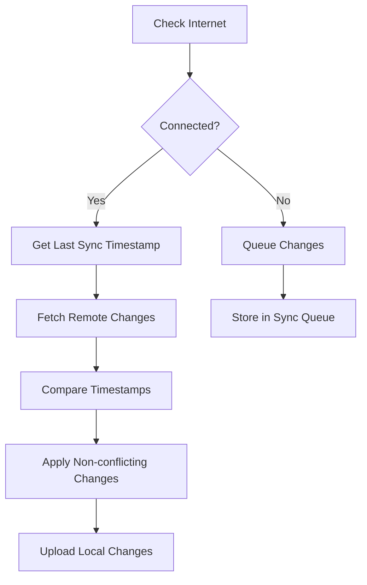

# IMMUNOVA App Architecture Plan

## 1. Database Structure

### Local SQLite Database
- Will mirror the PostgreSQL structure but with additional sync-related fields
- Each table will include:
  - `local_id`: Primary key for local operations
  - `remote_id`: ID from remote database (null if not yet synced)
  - `last_modified`: Timestamp for conflict resolution
  - `sync_status`: ENUM ('pending', 'synced', 'conflict')

### Sync-enabled Tables
- patients
- vaccinations
- appointments
- notifications
- inventory
- settings

## 2. Sync Mechanism

### Strategy
1. **Initial Setup**
   - On first launch: Create local SQLite database
   - On login: Perform full sync with Supabase

2. **Regular Sync Process**
   - Background sync every 30 minutes when online
   - Manual sync option in settings
   - Queue-based system for offline changes

3. **Conflict Resolution**
   - Last-modified timestamp as primary arbitrator
   - Local changes take precedence in conflicts
   - Conflict log maintained for manual resolution

### Sync Flow


## 3. Notifications System

### Types
1. **System Notifications**
   - Due vaccinations
   - Upcoming appointments
   - Inventory alerts
   - Sync status updates

2. **Implementation**
   - Background service checks notification table
   - Push notifications using local scheduler
   - Badge counts for unread items
   - Priority levels (high, medium, low)

## 4. Data Migration Plan

### From Hardcoded to Dynamic
1. **Phase 1: Schema Update**
   - Create migration scripts
   - Add new fields as needed
   - Preserve existing data

2. **Phase 2: Data Population**
   - Convert dummy data to SQL inserts
   - Add proper foreign key relationships
   - Implement data validation

### Database Queries
- Use parameterized queries
- Implement proper indexing
- Cache frequent queries

## 5. Technical Implementation

### Required Packages
```json
{
  "dependencies": {
    "sqlite3": "^5.x.x",
    "@supabase/supabase-js": "^2.x.x",
    "date-fns": "^2.x.x",
    "react-query": "^3.x.x"
  }
}
```

### Core Functions Needed
- initializeDatabase()
- syncWithRemote()
- handleOfflineChanges()
- processNotifications()
- resolveConflicts()

## 6. Testing Strategy

1. **Unit Tests**
   - Database operations
   - Sync functions
   - Conflict resolution

2. **Integration Tests**
   - Offline to online transitions
   - Data consistency checks
   - Notification delivery

3. **Edge Cases**
   - Network interruptions
   - Concurrent modifications
   - Large data sets

## 7. Next Steps

1. Create database migration scripts
2. Implement sync infrastructure
3. Set up notification system
4. Convert dummy data
5. Add offline support
6. Implement conflict resolution
7. Add comprehensive error handling
